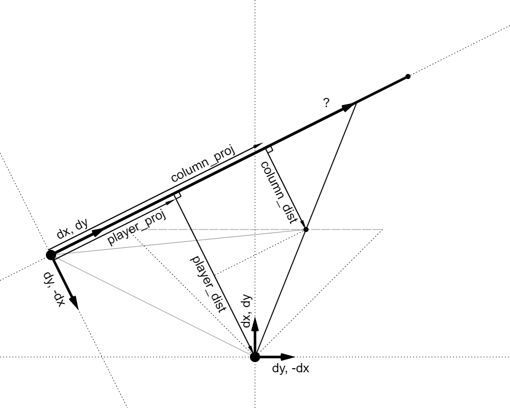

# Fake Doom

Another recreation of Doom rendering engine inspired by the [Recreating DOOM](https://www.youtube.com/watch?v=KdYTvqZmyBk&list=PLi77irUVkDasNAYQPr3N8nVcJLQAlANva) youtube series, which in turn seems to have been inspired by the [DIYDoom](https://github.com/amroibrahim/DIYDoom) project. Familiarity with both projects is assumed. 

This project is originaly written in javascript in two parts, which are available [here](https://kfdf.github.io/fake-doom/js/2d.html) and [here](https://kfdf.github.io/fake-doom/js/3d.html). The first part corresponds to the first three and a half episodes of Recreating Doom. Use arrow keys or numpad to move and rotate the player, use left Alt key for strafing and press and hold Space to see animated visualisation of search and traversal of BSP trees. Toggling switches in the upper left corner changes rendering options. The second, much larger part, is the final result. Additional controls include left Shift for very slow walking, Q and A to look up and down a bit. Holding Space now shows rendering of a frame in slow motion, column by column, row by row, sprite by sprite. 

The project is also available in C#, with (arguably) better structure and less clutter in some algorithms thanks to value types. Some enhancements over the javascript version include correct rendering of spectres (I tried to make them look cooler). There are no onscreen controls so options are controled by keyboard: keys 1 through 9 can be used to select a map, Z and X for zooming in and out, Tab for map view, D to toggle doors and raise floors in monster pits, L for light levels and O to toggle overbright mode. Also, the C# version support multiple resolutions and parallel rendering, controlled by the PageUp/PageDown and Home/End keys respectively.
 
The DIYDoom series end abruptly, and the creator of Recreating Doom added some missing features and took some different approaches. This project is no different. There are some additions and changes. The most obvious addition is rendering of monsters, items and semitransparent textures (which I call "floaters"). The C# version can also load pwads via command line arguments. The first argument is `1` or `2` for the respective doom version followed by additional wads, like so: `fakedoom 2 btsx_e2a.wad btsx_e2b.wad`. Maps with ZDoom's extended nodes, like `TheGiven` and many maps from `Sunder` are supported. Monsters and animations are limited to those in Doom 2, so any maps with custom animations and sprites will have glitches. This project is not about being complete and accurate, it's about math and algorithms, so non rendering functionality is kept to a minimum.

I tried to use approaches appropriate for the era, but within reason. For instance, `doubles` are used for all calculations (javascript doesn't really give you a choice here) but there are no multiplications in loops that draw pixel columns and rows. Also, the amount of work while rendering a frame should be proportional to the visible area and not the total map size and there should not be pathological cases, or at least they should be improbable.

## Segment Projection

I find all the trigonometry code in Recreating Doom and DIYDoom quite messy and make heavy use of the dot product instead. For instance, multiplying vectors from the player to segment edges by the line of sight unit vector and it's orthogonal gives us all the data we need to project the segment on the screen and find the range of columns it covers (all pixel ranges are half-open).

dist1 and dist2 are distances from the edges to the plane that is parallel to the screen and contains the player. These are the distances that we actually want so there is no need for "fisheye" corrections. 

Then we project column centers back on the segment. This is basically finding the intersection point of two lines, but we only need the distance to it from the segment edge and dot products give it to us without calulating square roots.

Since we are dealing with vectors and not lengths, math works out regardless of relative positions of various points. There are no separate cases to handle.

Same principle is applied to vertical pixel runs, upper and lower wall edges are projected on the screen, pixel range is found, clamped to the clipping range of the current screen column, and then centers of the pixels are projected back onto the segment to determine the pixel color.

## Clipping Array

A bit array is used for wall clipping and occlusion. It's relatively simple and fast, because it can test 32 columns at a time. It takes at most ten comparisions and some bit fiddling to determine if a certain range is visble or not. 

The clipping array is also used for BSP tree trimming. During tree traversal every node's bounding box edges as seen from the player's point of view are projected on the screen. That tells us if the box or part of it is inside the field of view, if so then the column range it spans is tested against the clipping array and if some part of it is visible the subtree is then traversed.

## Floors and Ceilings

While a segment is being rendered a pair of "flat renderers", one for ceilings and one for floors, keeps track of horizontal lines that form the floor/ceiling that lie right below/above the segment. These rows are grouped into three groups, one central "core" group with all the rows start at the left edge of the segment and two "edge" groups that lie above and below the core group with rows that don't start at the edge of the segment and their starting points are tracked individually. These groups change as the segment rendering progresses and rows are extended, created or drawn. Oftentimes, particulary when segments are small, the core group is by far the tallest. With some simple heuristics, some core groups are added to a block renderer. A flat renderer can have a bunch of block renderers for every combination of floor/ceiling texture, height and light level. A block renderer takes all the blocks that were added to it and tries to render them with continuous rows that are as long as possible. This short, but pretty nasty "linked list in an array" algrorithm makes barely any performance impact even in the most favorable conditions. Floating point multiplications are just that fast on modern hardware, so tryig to reduce them barely saves any time. But it's not too dissimilar to how visplane rendering worked in Doom, so it serves its representative purpose. In the C# version it can be disabled with the B key.

## Things and Floaters

As the BSP tree is being traversed during rendering, things that lie in the bounding boxes of its nodes and subsectors are set for rendering. Things may belong to nodes not just subsectors because a thing can lie in several subsectors and a subsector's bounding box doesn't cover the entire subsector, only segments in it. So, when the BSP tree is searched for a subsector to put a thing in, for every node if the thing doesn't lie completely on one side of the splitting line and inside the bounding box of a child, then the search is stopped and the thing is set to belong to the this node. Some things might end up very high in the tree, but for such simple approach the end result is acceptable.
A list of things and floaters is then sorted by the distance to them (for floaters it's the distance to its farthest edge) and they are rendered back to front with the zbuffer used for clipping. The zbuffer is an array of stacks, one stack per screen column, that are filled with "clipping windows" when segments are rendered and occlusion is possible. When things are rendered these "clipping windows" are popped from their stacks to clip individual columns of the sprites, so the stacks are only traversed at most once in every direction. Floaters are rendered alongside things one column at a time, and since that changes distances to them they can be rerendered several times until they are completely "consumed".
